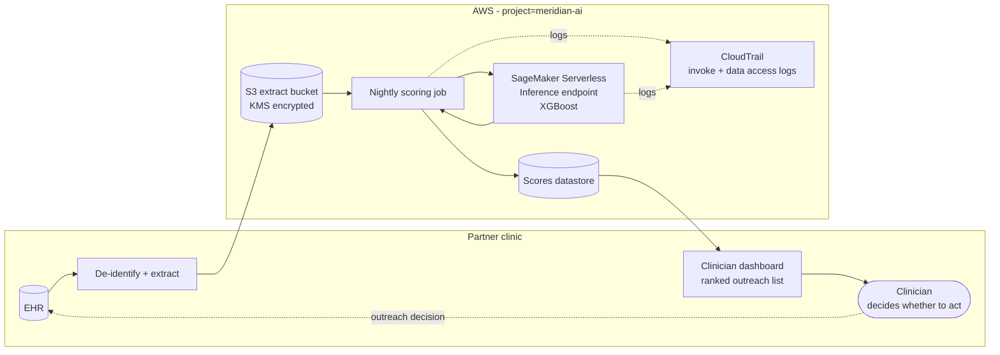

# Meridian Rising Risk Score: Data Flow

## Trust boundaries

| Boundary | What crosses it | Control |
|---|---|---|
| Clinic EHR to AWS | De-identified feature extract only | De-identification at source; TLS in transit; KMS at rest |
| Scoring job to endpoint | Feature vectors | Scoped IAM role; VPC / private networking `TODO` |
| Scores back to dashboard | Score, tier, top features | `TODO` |

## Affected-person touchpoint

Patients never interact with the system. The only effect on a patient is a change in the
*likelihood and priority* of proactive outreach, mediated entirely by a clinician's
decision.
